# Laporan Implementasi dan Hasil Skenario 01

## Optimasi Random Forest dan SVR Menggunakan ABC dan PSO pada Data Single Unit

| Informasi | Keterangan |
|---|---|
| Proyek | Vehicle Health — Forecasting Remaining Useful Life |
| Skenario | 01 — RF dan SVR pada data single unit |
| Dataset | `datas/Data_PT.Amanah_Critical_Break.xlsx` |
| Target | `sisa jam` atau Remaining Useful Life (RUL) |
| Model | Random Forest Regressor dan Support Vector Regression |
| Optimizer | Artificial Bee Colony dan Particle Swarm Optimization |
| Tanggal laporan | 16 September 2026 |
| Dasar laporan | Artefak hasil eksekusi aktual Skenario 01 |

## 1. Ringkasan Eksekutif

Skenario 01 bertujuan memperkirakan sisa waktu operasi unit sebelum mencapai titik kerusakan. Model hanya menggunakan delapan variabel sensor sebagai fitur. `Unit Lifetime (Hour)` tidak digunakan sebagai fitur karena kolom tersebut merupakan komponen langsung pembentuk target dan dapat menyebabkan kebocoran target.

Eksperimen membandingkan empat kandidat:

1. ABC–Random Forest.
2. ABC–SVR.
3. PSO–Random Forest.
4. PSO–SVR.

Berdasarkan kriteria pemilihan berupa MSE cross-validation terendah, kandidat yang terpilih adalah **PSO–SVR**. Kandidat ini menghasilkan CV RMSE sebesar **115,5913 jam**, test RMSE sebesar **105,6560 jam**, test MAE sebesar **57,3942 jam**, dan test R² sebesar **0,97884**.

Hasil PSO–SVR dan ABC–SVR pada eksperimen ini praktis setara. Selisih CV MSE keduanya hanya sekitar **0,00014%**. PSO–SVR tetap dipilih karena mempunyai nilai CV MSE yang sedikit lebih kecil sesuai aturan pemilihan yang telah ditetapkan.

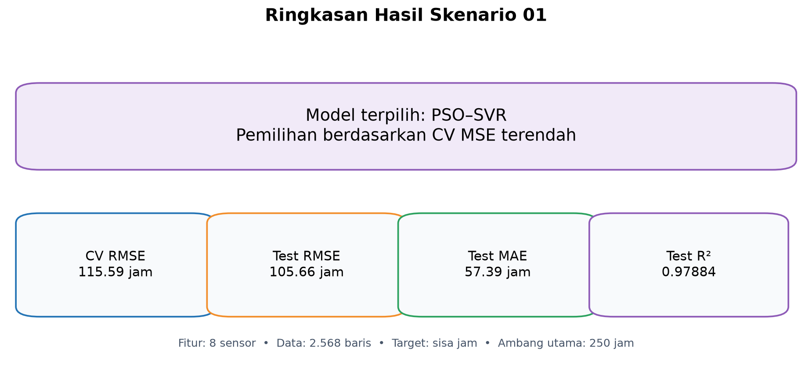

*Gambar 1. Ringkasan model terpilih dan metrik utama. Sumber: hasil pengolahan Skenario 01.*

## 2. Tujuan Skenario

Implementasi ini mempunyai tujuan berikut:

- Membentuk target RUL berdasarkan waktu kerusakan unit.
- Menguji kemampuan delapan sensor dalam memperkirakan RUL tanpa memakai lifetime sebagai fitur.
- Membandingkan Random Forest dan SVR pada pembagian data yang sama.
- Membandingkan kemampuan ABC dan PSO dalam mencari hyperparameter.
- Mengevaluasi model sebagai regresi dan sebagai sistem peringatan berbasis ambang sisa jam.
- Memilih, melatih ulang, menyimpan, dan memverifikasi model terbaik.

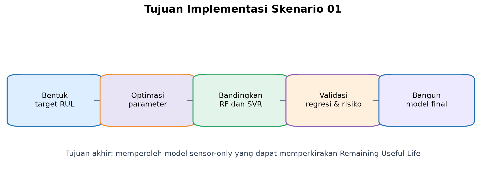

*Gambar 2. Hubungan antara tujuan pengolahan data, optimasi, validasi, dan pembangunan model final.*

## 3. Struktur Implementasi

| File | Fungsi |
|---|---|
| `ABC_RF_SVR.ipynb` | Optimasi Random Forest dan SVR menggunakan ABC |
| `PSO_RF_SVR.ipynb` | Optimasi Random Forest dan SVR menggunakan PSO |
| `Build_Models.ipynb` | Membandingkan kandidat, melatih ulang, dan menyimpan model final |
| `../artifacts/` | Menyimpan metrik, prediksi, grafik, dan model hasil optimasi |
| `models/` | Menyimpan empat model hasil build dan model terbaik |

Random Forest dan SVR ditempatkan pada cell eksekusi terpisah. Pemisahan ini memungkinkan salah satu proses dihentikan atau dijalankan ulang tanpa mengulang model lain yang telah selesai.

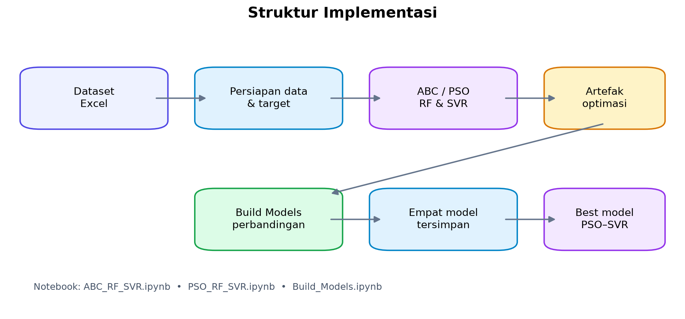

*Gambar 3. Struktur aliran data dari dataset hingga model PSO–SVR terpilih.*

## 4. Dataset dan Pembentukan Target

### 4.1 Profil data

Setelah pembersihan, data yang digunakan berjumlah **2.568 baris**.

| Status | Jumlah | Proporsi |
|---|---:|---:|
| Normal | 1.847 | 71,92% |
| Critical | 720 | 28,04% |
| Break | 1 | 0,04% |
| **Total** | **2.568** | **100%** |

Jam saat unit mencapai status `Break` adalah **78.637 jam**. Target dibentuk menggunakan rumus:

```text
sisa_jam = clip(jam_break - unit_lifetime, 0, 2550)
```

Nilai target dibatasi antara 0 dan 2.550 jam.

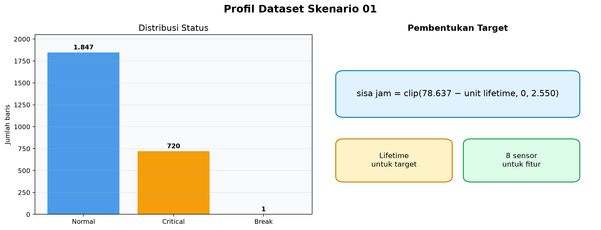

*Gambar 4. Distribusi status dan pemisahan peran lifetime dengan delapan fitur sensor.*

### 4.2 Fitur model

Fitur yang digunakan adalah:

1. Exhaust Gas Temperature LF (Left Front).
2. Exhaust Gas Temperature LR (Left Rear).
3. Exhaust Gas Temperature RF (Right Front).
4. Exhaust Gas Temperature RR (Right Rear).
5. Blowby Pressure (Kpa).
6. Boost Pressure (Kpa).
7. Engine Oil Temp (°C).
8. Coolant Temp (°C).

`Unit Lifetime (Hour)` hanya digunakan untuk menghitung target. `Status` hanya digunakan untuk analisis distribusi dan metrik per status. Keduanya tidak menjadi fitur model.

## 5. Metode Validasi

### 5.1 Pembagian data

Data dibagi secara acak dengan konfigurasi:

```text
training data = 80% atau 2.054 baris
test data     = 20% atau 514 baris
random_state  = 42
```

Data test terdiri atas 350 baris Normal, 163 baris Critical, dan satu baris Break.

### 5.2 Cross-validation

Optimasi menggunakan shuffled K-Fold dengan lima fold dan seed 42. Fungsi objektif yang diminimalkan adalah rata-rata MSE cross-validation.

Setelah parameter terbaik ditemukan, `cross_val_predict` digunakan untuk membentuk prediksi out-of-fold (OOF). Setiap prediksi OOF berasal dari model yang tidak dilatih menggunakan baris yang sedang diprediksi. Pendekatan ini lebih tepat untuk menilai data training daripada memakai prediksi in-sample.

Data test hanya digunakan untuk evaluasi akhir dan tidak menjadi dasar pencarian hyperparameter.

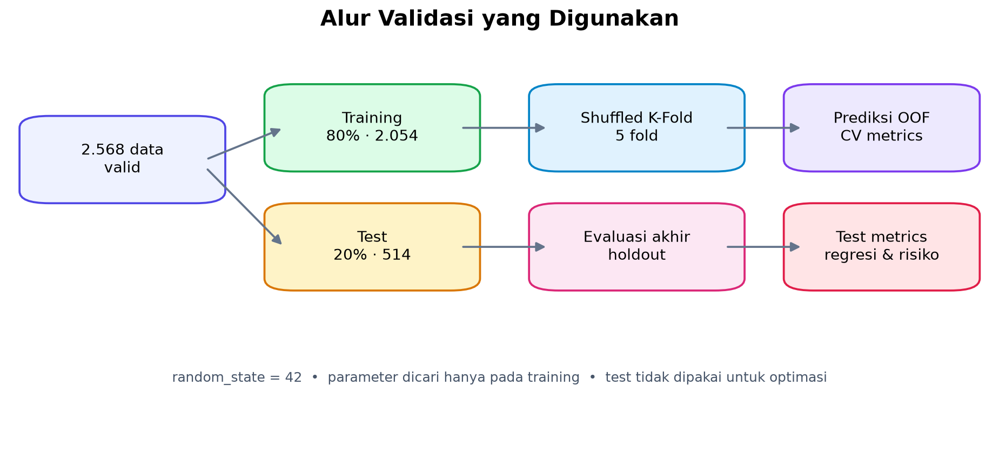

*Gambar 5. Pembagian holdout dan pembentukan prediksi out-of-fold pada data training.*

### 5.3 Metrik regresi

Metrik utama yang digunakan adalah:

- MSE untuk memberi penalti lebih besar pada galat besar.
- RMSE untuk menyatakan besar galat dalam satuan jam.
- MAE untuk menyatakan rata-rata selisih absolut dalam jam.
- R² untuk mengukur proporsi variasi target yang dijelaskan model.

Nilai MSE, RMSE, dan MAE yang lebih kecil menunjukkan hasil lebih baik. Nilai R² yang mendekati 1 menunjukkan kemampuan penjelasan variasi target yang lebih tinggi.

### 5.4 Evaluasi berbasis ambang

Forecasting tetap merupakan permasalahan regresi. Untuk kebutuhan interpretasi operasional, hasil regresi juga dievaluasi sebagai keputusan biner menggunakan ambang 100, 250, dan 500 jam.

```text
kelas positif = sisa jam <= ambang
kelas negatif = sisa jam > ambang
```

Ambang utama laporan adalah **250 jam**. Confusion matrix memakai istilah standar tanpa mengganti namanya:

|  | Prediksi negatif | Prediksi positif |
|---|---:|---:|
| Aktual negatif | TN | FP |
| Aktual positif | FN | TP |

Metrik turunannya adalah:

```text
Accuracy  = (TP + TN) / (TP + TN + FP + FN)
Precision = TP / (TP + FP)
Recall    = TP / (TP + FN)
F1 Score  = 2 × Precision × Recall / (Precision + Recall)
```

FN menjadi perhatian penting karena menunjukkan kondisi yang sebenarnya sudah mendekati kerusakan, tetapi tidak terdeteksi oleh model.

Contoh keluaran visual validasi dapat dilihat pada confusion matrix ABC–Random Forest dan PSO–SVR berikut.


*Gambar 6. Prediksi OOF dan confusion matrix ABC–Random Forest.*


*Gambar 7. Prediksi OOF dan confusion matrix PSO–SVR.*

## 6. Implementasi Optimasi

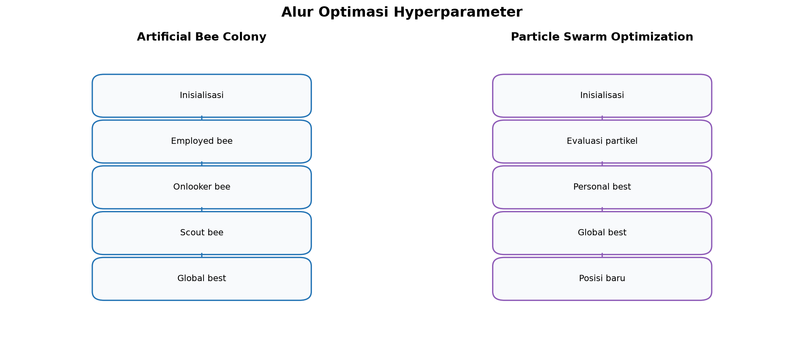

*Gambar 8. Perbedaan alur pencarian hyperparameter antara ABC dan PSO.*

### 6.1 Artificial Bee Colony

ABC merepresentasikan satu kombinasi hyperparameter sebagai satu sumber makanan. Proses pencarian terdiri atas employed bee, onlooker bee, dan scout bee. Kualitas solusi ditentukan oleh MSE cross-validation. Cache evaluasi digunakan agar kombinasi parameter yang sama tidak dilatih berulang kali.


*Gambar 9. Kurva konvergensi dan hasil prediksi test ABC–Random Forest.*


*Gambar 10. Kurva konvergensi dan hasil prediksi test ABC–SVR.*

### 6.2 Particle Swarm Optimization

PSO merepresentasikan satu kombinasi hyperparameter sebagai posisi partikel. Posisi diperbarui berdasarkan kecepatan, personal best, dan global best. Model, pembagian data, ruang pencarian, serta fungsi objektif disamakan dengan ABC agar perbandingan tetap adil.


*Gambar 11. Kurva konvergensi dan hasil prediksi test PSO–Random Forest.*


*Gambar 12. Kurva konvergensi dan hasil prediksi test PSO–SVR.*

### 6.3 Model

Random Forest menggabungkan prediksi banyak decision tree. SVR menggunakan kernel RBF dan dibungkus dalam `Pipeline(StandardScaler, SVR)`. StandardScaler dilatih hanya pada bagian training setiap fold sehingga informasi fold validasi tidak digunakan saat proses scaling.

## 7. Hasil Optimasi dan Regresi

### 7.1 Perbandingan cross-validation dan test

| Kandidat | CV MSE | CV RMSE | Test MSE | Test RMSE | Test MAE | Test R² |
|---|---:|---:|---:|---:|---:|---:|
| ABC–RF | 24.087,5522 | 155,2017 | 16.681,4767 | 129,1568 | 64,6909 | 0,96838 |
| ABC–SVR | 13.361,3745 | 115,5914 | 11.172,1700 | 105,6985 | 57,4198 | 0,97882 |
| PSO–RF | 24.118,3416 | 155,3008 | 16.012,6590 | 126,5411 | 66,9672 | 0,96964 |
| **PSO–SVR** | **13.361,3562** | **115,5913** | **11.163,1829** | **105,6560** | **57,3942** | **0,97884** |

SVR memberikan hasil regresi lebih baik daripada Random Forest pada CV maupun data test. Dibandingkan PSO–RF, PSO–SVR menurunkan test RMSE sekitar 20,34 jam dan menaikkan test R² dari 0,96964 menjadi 0,97884.

### 7.2 Hasil OOF parameter terbaik

| Kandidat | OOF MSE | OOF RMSE | OOF MAE | OOF R² |
|---|---:|---:|---:|---:|
| ABC–RF | 24.087,4500 | 155,2013 | 79,1307 | 0,95655 |
| ABC–SVR | 13.361,1544 | 115,5905 | 65,5812 | 0,97590 |
| PSO–RF | 24.118,1612 | 155,3002 | 81,4686 | 0,95650 |
| PSO–SVR | 13.361,1338 | 115,5904 | 65,5629 | 0,97590 |

Nilai OOF dan rata-rata cross-validation sangat berdekatan. Hal ini menunjukkan proses evaluasi parameter terbaik konsisten dengan fungsi objektif optimizer.

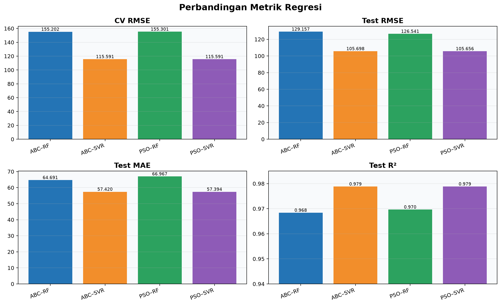

*Gambar 13. Perbandingan CV RMSE, test RMSE, test MAE, dan test R² seluruh kandidat.*

## 8. Hasil Evaluasi Ambang 250 Jam

### 8.1 Cross-validation OOF

| Kandidat | TN | FP | FN | TP | Accuracy | Precision | Recall | F1 Score |
|---|---:|---:|---:|---:|---:|---:|---:|---:|
| ABC–RF | 1.848 | 0 | 58 | 148 | 97,18% | 100,00% | 71,84% | 83,62% |
| ABC–SVR | 1.837 | 11 | 66 | 140 | 96,25% | 92,72% | 67,96% | 78,43% |
| PSO–RF | 1.848 | 0 | 58 | 148 | 97,18% | 100,00% | 71,84% | 83,62% |
| PSO–SVR | 1.837 | 11 | 66 | 140 | 96,25% | 92,72% | 67,96% | 78,43% |

Pada validasi OOF ambang 250 jam, Random Forest mempunyai F1 Score lebih tinggi daripada SVR. Random Forest tidak menghasilkan FP, tetapi masih melewatkan 58 kondisi positif.

### 8.2 Data test

| Kandidat | TN | FP | FN | TP | Accuracy | Precision | Recall | F1 Score |
|---|---:|---:|---:|---:|---:|---:|---:|---:|
| ABC–RF | 469 | 0 | 12 | 33 | 97,67% | 100,00% | 73,33% | 84,62% |
| ABC–SVR | 465 | 4 | 7 | 38 | 97,86% | 90,48% | 84,44% | 87,36% |
| PSO–RF | 469 | 0 | 13 | 32 | 97,47% | 100,00% | 71,11% | 83,12% |
| **PSO–SVR** | **465** | **4** | **7** | **38** | **97,86%** | **90,48%** | **84,44%** | **87,36%** |

Pada data test, SVR memberikan Recall dan F1 Score terbaik. SVR berhasil mendeteksi 38 dari 45 kondisi yang berada dalam ambang 250 jam, tetapi menghasilkan empat FP dan tujuh FN.

Accuracy yang tinggi harus dibaca bersama Recall dan F1 Score karena jumlah data negatif jauh lebih banyak daripada data positif. Model yang hanya dominan memprediksi kelas negatif tetap dapat memperoleh Accuracy tinggi.

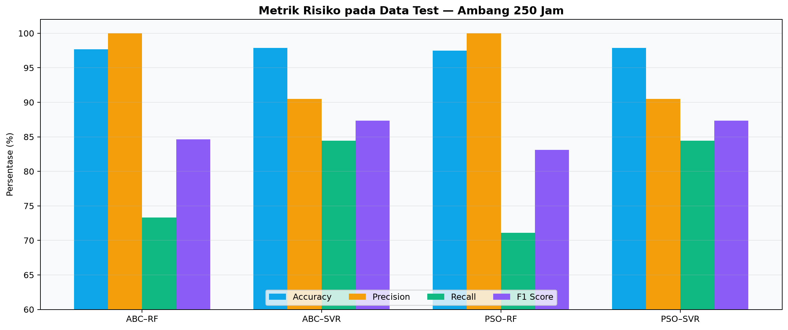

*Gambar 14. Accuracy, Precision, Recall, dan F1 Score pada data test dengan ambang 250 jam.*

## 9. Hyperparameter Terbaik

| Kandidat | Hyperparameter terbaik |
|---|---|
| ABC–RF | `n_estimators=286`, `max_depth=20`, `min_samples_split=2`, `min_samples_leaf=1`, `max_features=0,86495` |
| PSO–RF | `n_estimators=217`, `max_depth=30`, `min_samples_split=2`, `min_samples_leaf=1`, `max_features=0,75000` |
| ABC–SVR | `C=1000`, `epsilon=0,001`, `gamma=0,40072`, `kernel=rbf` |
| PSO–SVR | `C=1000`, `epsilon=0,001`, `gamma=0,40118`, `kernel=rbf` |

Kedua optimizer menemukan konfigurasi SVR yang hampir sama. Hal ini menjelaskan mengapa hasil ABC–SVR dan PSO–SVR sangat berdekatan.

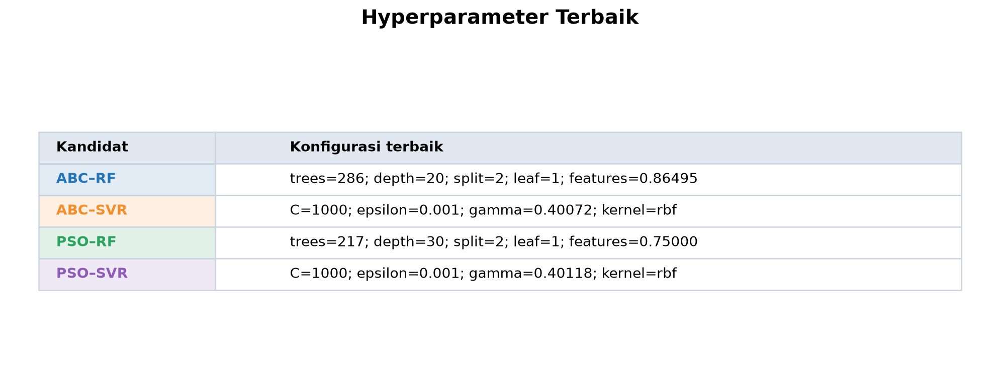

*Gambar 15. Ringkasan hyperparameter terbaik yang ditemukan setiap kombinasi optimizer dan model.*

## 10. Waktu dan Jumlah Evaluasi Optimasi

| Kandidat | Evaluasi objektif | Waktu | Keterangan |
|---|---:|---:|---|
| ABC–RF | 512 | 16,97 menit | Evaluasi terbanyak |
| ABC–SVR | 398 | 8,61 menit | SVR tercepat |
| PSO–RF | 299 | 14,07 menit | Evaluasi RF lebih sedikit dari ABC |
| PSO–SVR | 320 | 13,28 menit | Model terpilih |

Waktu berasal dari eksekusi aktual dan dapat berubah sesuai perangkat, beban sistem, serta versi dependensi. Jumlah evaluasi objektif tidak dapat dibandingkan sendirian karena waktu satu evaluasi Random Forest dan SVR berbeda.

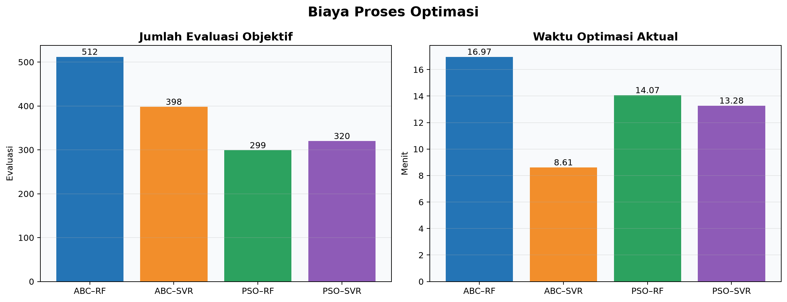

*Gambar 16. Perbandingan jumlah evaluasi objektif dan waktu optimasi aktual.*

## 11. Build Model Final

Notebook Build Models melakukan tahapan berikut:

1. Membaca hasil empat kandidat.
2. Memvalidasi cakupan data dan fitur.
3. Mengurutkan kandidat berdasarkan CV MSE.
4. Melatih ulang seluruh kandidat menggunakan 2.568 baris data valid.
5. Menyimpan empat model kandidat.
6. Menyalin PSO–SVR sebagai `best_model.joblib`.
7. Memuat kembali setiap model dan memverifikasi konsistensi prediksi.

Seluruh pemeriksaan reload menghasilkan nilai `true`, sehingga prediksi model sebelum dan setelah serialisasi tetap konsisten.

Metrik training penuh hanya digunakan sebagai diagnosis. Metrik tersebut tidak digunakan untuk memilih kandidat karena model dievaluasi pada data yang sama dengan data pelatihannya sehingga nilainya cenderung optimistis.

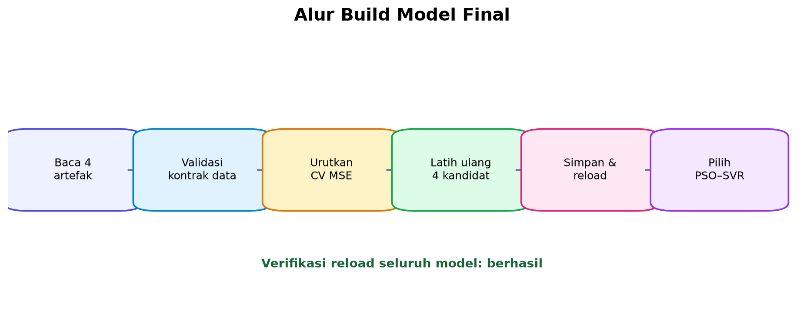

*Gambar 17. Tahapan Build Models dari pembacaan artefak sampai pemilihan PSO–SVR.*

## 12. Analisis Hasil yang Terlihat Sangat Tinggi

Versi awal eksperimen pernah menghasilkan titik prediksi yang hampir sepenuhnya menempel pada garis aktual. Penyebab utamanya adalah penggunaan `Unit Lifetime (Hour)` sebagai fitur, padahal target dihitung langsung dari lifetime:

```text
sisa jam = jam break - unit lifetime
```

Kondisi tersebut merupakan target leakage. Implementasi Skenario 01 saat ini sudah mengeluarkan lifetime dari fitur dan hanya menggunakan delapan sensor.

Walaupun demikian, R² saat ini masih tinggi. Beberapa penyebab yang perlu dipertimbangkan adalah:

- Seluruh data berasal dari satu unit yang sama.
- Pembagian acak dapat menempatkan observasi yang berdekatan dan sangat mirip pada training dan test.
- Perubahan sensor dapat berkorelasi kuat dengan usia operasi unit.
- Rentang visual 0–2.550 jam membuat galat sekitar 50–150 jam tampak kecil pada scatter plot.

Dengan demikian, hasil ini menunjukkan kemampuan model melakukan interpolasi pada riwayat unit yang sama. Hasil ini belum cukup untuk menyimpulkan bahwa model akan mempunyai performa serupa pada unit kendaraan lain.

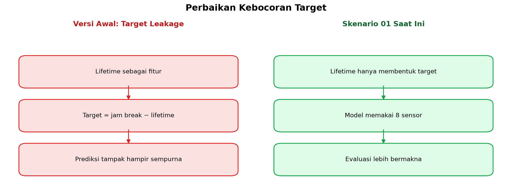

*Gambar 18. Perbedaan versi awal yang mengalami target leakage dan implementasi sensor-only saat ini.*

## 13. Keterbatasan

1. Dataset hanya mewakili satu unit.
2. Hanya terdapat satu baris berstatus Break.
3. Random split tidak sepenuhnya menguji generalisasi terhadap unit atau perjalanan baru.
4. Target dibatasi pada 2.550 jam sehingga observasi sebelum batas tersebut mempunyai target yang sama.
5. Evaluasi berbasis ambang sensitif terhadap pemilihan nilai ambang.
6. Accuracy dapat terlihat tinggi akibat ketidakseimbangan kelas positif dan negatif.
7. Selisih ABC–SVR dan PSO–SVR sangat kecil sehingga urutan terbaik dapat berubah pada seed atau data lain.

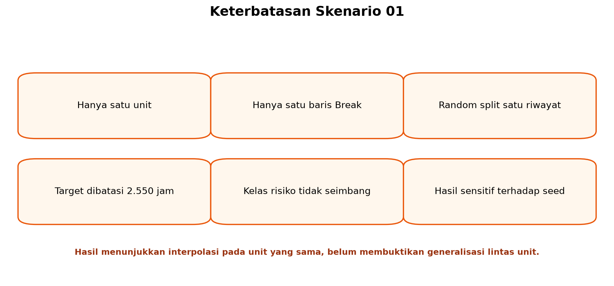

*Gambar 19. Ringkasan keterbatasan yang perlu diperhatikan ketika membaca hasil.*

## 14. Rekomendasi

- Pertahankan shuffled K-Fold dan prediksi OOF untuk eksperimen data acak pada unit yang sama.
- Utamakan RMSE, MAE, R², Recall, dan F1 Score; jangan memakai Accuracy sendirian.
- Pantau FN secara khusus karena merepresentasikan peringatan kerusakan yang terlewat.
- Tambahkan data dari beberapa unit dan beberapa kejadian Break.
- Jika data multi-unit tersedia, gunakan `GroupKFold` atau leave-one-unit-out berdasarkan identitas unit.
- Lakukan pengujian temporal sebagai skenario tambahan apabila urutan waktu pengambilan data dapat dipercaya.
- Uji kestabilan optimizer menggunakan beberapa seed sebelum menyatakan salah satu optimizer secara umum lebih baik.

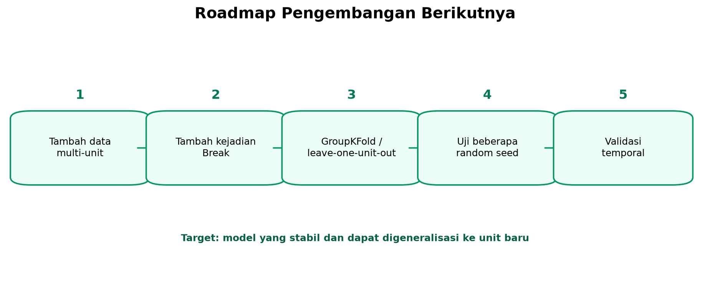

*Gambar 20. Urutan pengembangan yang disarankan untuk meningkatkan generalisasi model.*

## 15. Kesimpulan

Skenario 01 berhasil membangun pipeline forecasting RUL yang membandingkan dua model dan dua optimizer pada kontrak data yang sama. Berdasarkan CV MSE, **PSO–SVR** dipilih sebagai model final. Model tersebut mempunyai test RMSE sekitar **105,66 jam**, MAE sekitar **57,39 jam**, dan R² sekitar **0,97884**.

Pada evaluasi test dengan ambang 250 jam, PSO–SVR menghasilkan TN 465, FP 4, FN 7, TP 38, Accuracy 97,86%, Precision 90,48%, Recall 84,44%, dan F1 Score 87,36%.

Hasil ini baik untuk data single unit yang tersedia, tetapi belum membuktikan generalisasi pada unit lain. Pengembangan berikutnya sebaiknya memprioritaskan data multi-unit, validasi berbasis grup, penambahan kejadian Break, dan evaluasi beberapa seed.

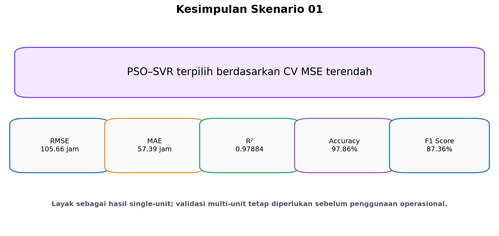

*Gambar 21. Ringkasan hasil akhir, metrik utama, dan batas interpretasi Skenario 01.*
