# Laporan Implementasi dan Hasil Skenario 02

## Optimasi Random Forest dan SVR Menggunakan ABC dan PSO pada Data Gabungan

| Informasi | Keterangan |
|---|---|
| Proyek | Vehicle Health — Forecasting Remaining Useful Life |
| Skenario | 02 — RF dan SVR pada data gabungan empat unit |
| Dataset | `datas/vehicle-health-gabungan.xlsx` |
| Target | `sisa jam` atau Remaining Useful Life (RUL) |
| Model | Random Forest Regressor dan Support Vector Regression |
| Optimizer | Artificial Bee Colony dan Particle Swarm Optimization |

## 1. Ringkasan Eksekutif

Skenario 02 menggunakan 3.168 baris dari empat unit dan delapan sensor sebagai fitur. Sebanyak 2.568 target berasal dari break aktual PT Amanah; 600 target tiga unit lainnya adalah pseudo-RUL dari model referensi Skenario 01.

Empat kandidat dibandingkan: ABC–RF, ABC–SVR, PSO–RF, dan PSO–SVR. Berdasarkan MSE cross-validation terendah, **PSO–Random Forest** dipilih. Hasilnya: CV RMSE **166,7739 jam**, test RMSE **141,7102 jam**, test MAE **80,9453 jam**, dan test R² **0,96781**.

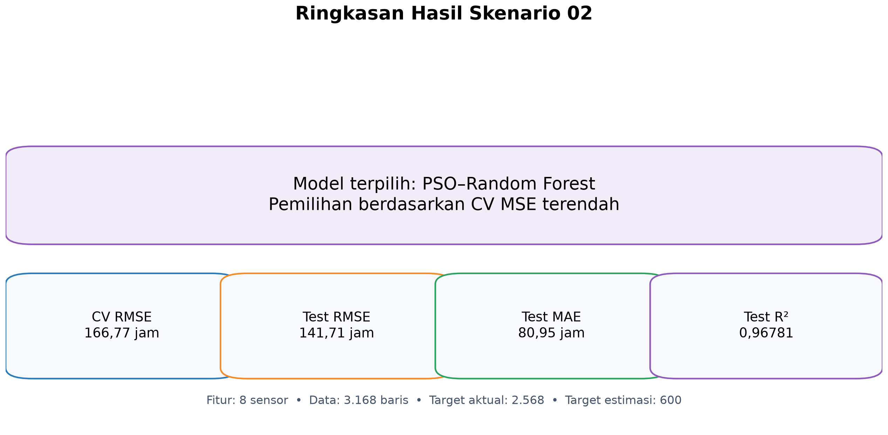

*Gambar 1. Ringkasan model terpilih dan metrik utama.*

## 2. Tujuan Skenario

1. Menggabungkan data empat unit dengan atribut yang sama.
2. Membentuk target RUL untuk seluruh unit.
3. Membandingkan Random Forest dan SVR.
4. Membandingkan ABC dan PSO.
5. Mengevaluasi regresi serta peringatan berbasis ambang.
6. Membangun dan menyimpan model terbaik.

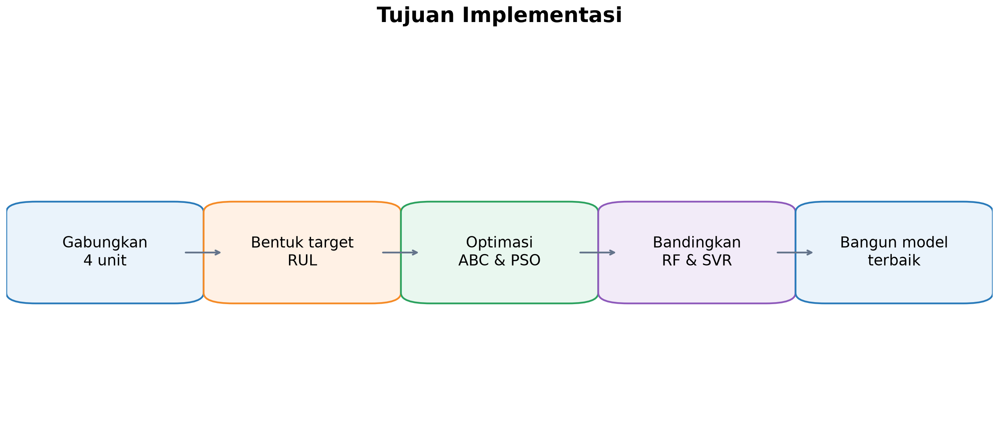

*Gambar 2. Alur tujuan implementasi.*

## 3. Struktur Implementasi

| File atau folder | Fungsi |
|---|---|
| `ABC_RF_SVR.ipynb` | Optimasi RF dan SVR menggunakan ABC |
| `PSO_RF_SVR.ipynb` | Optimasi RF dan SVR menggunakan PSO |
| `Build_Models.ipynb` | Membandingkan kandidat dan membangun model final |
| `artifacts/` | Metrik, prediksi, grafik, dan model optimasi |
| `models/` | Model build dan `best_model.joblib` |
| `report/` | Laporan dan gambar pendukung |

RF dan SVR dibuat pada cell terpisah agar proses dapat dikendalikan secara mandiri.

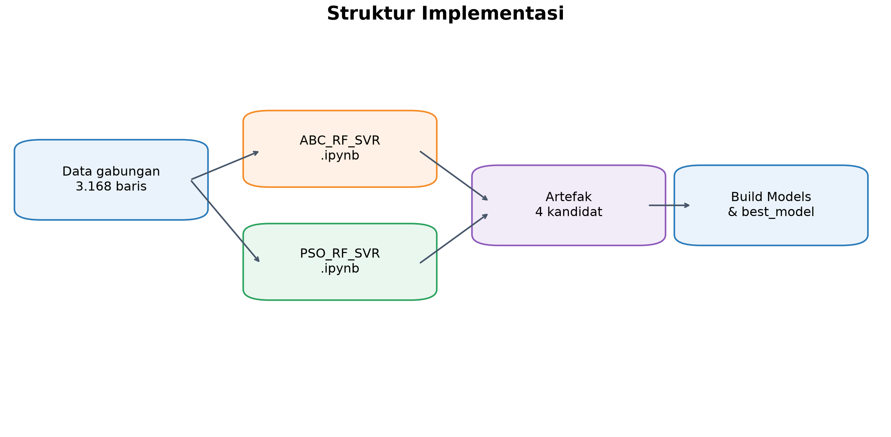

*Gambar 3. Aliran data dari dataset hingga model final.*

## 4. Dataset dan Pembentukan Target

### 4.1 Profil data

Dataset berisi **3.168 baris**.

| Unit | Baris | Proporsi |
|---|---:|---:|
| PT Amanah | 2.568 | 81,06% |
| Unit 231 | 200 | 6,31% |
| Unit 230 | 200 | 6,31% |
| Unit 228 | 200 | 6,31% |
| **Total** | **3.168** | **100,00%** |

Status terdiri dari 1.871 `normal`, 1.296 `critical`, dan satu `break`. Break aktual hanya terdapat pada PT Amanah pada 78.637 jam.

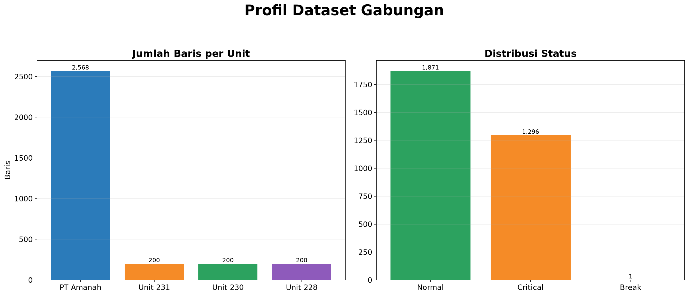

*Gambar 4. Komposisi data berdasarkan unit dan status.*

### 4.2 Target dan fitur model

Target dibentuk dengan rumus:

```text
sisa_jam = clip(jam_break_unit - unit_lifetime, 0, 2550)
```

| Sumber target | Baris | Dasar pembentukan |
|---|---:|---|
| Aktual | 2.568 | Break PT Amanah pada 78.637 jam |
| Estimasi | 600 | Jam break model referensi Skenario 01 |

Unit 231, Unit 230, dan Unit 228 memakai jam break estimasi 54.306,26; 55.006,64; dan 55.628,49 jam. Delapan sensor menjadi fitur. `Unit Lifetime`, `Status`, `unit_id`, dan `target_source` tidak menjadi fitur agar tidak terjadi kebocoran target.

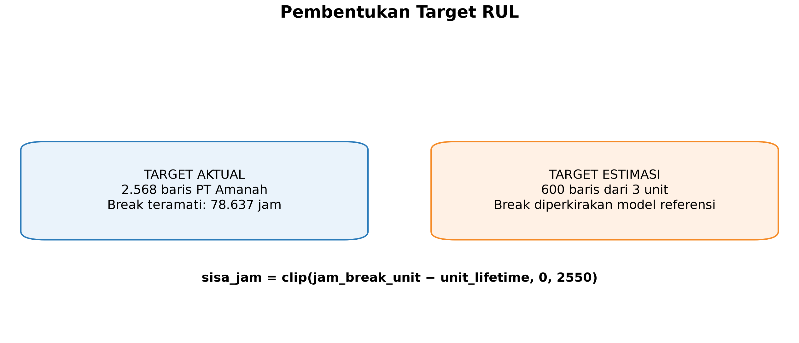

*Gambar 5. Pemisahan target aktual dan pseudo-RUL.*

## 5. Metode Validasi

### 5.1 Pembagian data

```text
training data = 80% atau 2.534 baris
test data     = 20% atau 634 baris
random_state  = 42
```

### 5.2 Cross-validation

Optimasi memakai shuffled K-Fold lima fold dengan seed 42. Fungsi objektifnya adalah rata-rata MSE CV. Prediksi OOF dibuat melalui `cross_val_predict`, sehingga tiap baris training diprediksi oleh model yang tidak dilatih menggunakan baris tersebut. Test hanya digunakan untuk evaluasi akhir.

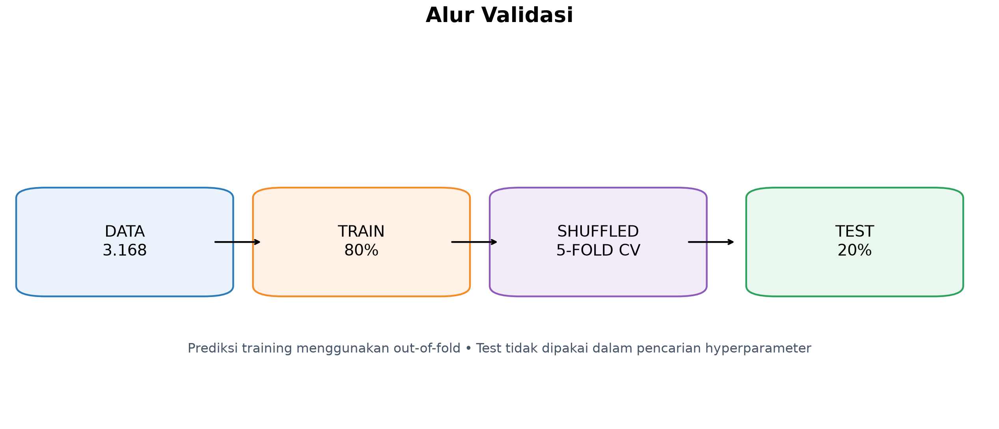

*Gambar 6. Holdout acak dan cross-validation lima fold.*

### 5.3 Metrik regresi

Metrik yang digunakan ialah MSE, RMSE, MAE, dan R². MSE, RMSE, serta MAE lebih kecil adalah lebih baik; R² yang mendekati satu adalah lebih baik.

### 5.4 Evaluasi berbasis ambang

Forecasting tetap merupakan regresi. Untuk peringatan operasional, hasil juga dievaluasi pada ambang 100, 250, dan 500 jam.

```text
kelas positif = sisa_jam <= ambang
kelas negatif = sisa_jam > ambang
```

Ambang utama laporan adalah 250 jam. Confusion matrix mempertahankan istilah TN, FP, FN, dan TP. Metrik turunannya adalah Accuracy, Precision, Recall, dan F1 Score. FN penting karena menandakan kondisi mendekati break tetapi tidak terdeteksi.


*Gambar 7. Hasil running validasi OOF ABC–Random Forest.*


*Gambar 8. Hasil running validasi OOF PSO–Random Forest.*

## 6. Implementasi Optimasi

### 6.1 Artificial Bee Colony

ABC merepresentasikan kombinasi hyperparameter sebagai sumber makanan. Pencarian terdiri dari employed bee, onlooker bee, dan scout bee. Kualitas kandidat ditentukan oleh MSE CV; cache digunakan untuk menghindari evaluasi parameter yang sama.


*Gambar 9. Hasil running ABC–Random Forest.*


*Gambar 10. Hasil running ABC–SVR.*

### 6.2 Particle Swarm Optimization

PSO merepresentasikan kandidat sebagai posisi partikel. Posisi diperbarui melalui kecepatan, personal best, dan global best. Ruang pencarian, pembagian data, dan fungsi objektif disamakan dengan ABC.


*Gambar 11. Hasil running PSO–Random Forest.*


*Gambar 12. Hasil running PSO–SVR.*

### 6.3 Model

Random Forest menggabungkan banyak decision tree. SVR menggunakan kernel RBF melalui `Pipeline(StandardScaler, SVR)`. Scaling dilakukan hanya pada data training setiap fold.

## 7. Hasil Optimasi dan Regresi

### 7.1 Perbandingan cross-validation dan test

| Kandidat | CV MSE | CV RMSE | Test MSE | Test RMSE | Test MAE | Test R² |
|---|---:|---:|---:|---:|---:|---:|
| ABC–RF | 28.524,3909 | 168,8917 | 20.140,4911 | 141,9172 | 80,4947 | 0,96771 |
| ABC–SVR | 42.244,5177 | 205,5347 | 29.099,9035 | 170,5869 | 100,2742 | 0,95335 |
| **PSO–RF** | **27.813,5244** | **166,7739** | **20.081,7896** | **141,7102** | **80,9453** | **0,96781** |
| PSO–SVR | 42.243,6767 | 205,5327 | 29.099,9674 | 170,5871 | 100,3178 | 0,95335 |

PSO–RF unggul pada CV MSE, test RMSE, dan test R². ABC–RF memiliki MAE test sedikit lebih rendah, tetapi model final tetap mengikuti CV MSE terendah.

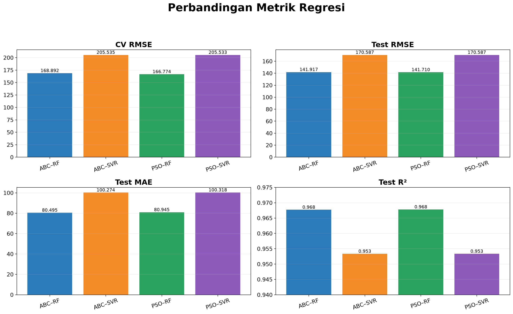

*Gambar 13. Perbandingan metrik regresi seluruh kandidat.*

### 7.2 Hasil OOF parameter terbaik

| Kandidat | OOF MSE | OOF RMSE | OOF MAE | OOF R² |
|---|---:|---:|---:|---:|
| ABC–RF | 28.526,0327 | 168,8965 | 94,9648 | 0,95508 |
| ABC–SVR | 42.247,8131 | 205,5427 | 115,6164 | 0,93347 |
| **PSO–RF** | **27.814,9912** | **166,7783** | **93,7167** | **0,95620** |
| PSO–SVR | 42.246,9699 | 205,5407 | 115,6341 | 0,93347 |

## 8. Hasil Evaluasi Ambang 250 Jam

### 8.1 Cross-validation OOF

| Kandidat | TN | FP | FN | TP | Accuracy | Precision | Recall | F1 Score |
|---|---:|---:|---:|---:|---:|---:|---:|---:|
| ABC–RF | 2.328 | 0 | 66 | 140 | 97,40% | 100,00% | 67,96% | 80,92% |
| ABC–SVR | 2.321 | 7 | 81 | 125 | 96,53% | 94,70% | 60,68% | 73,96% |
| **PSO–RF** | **2.328** | **0** | **64** | **142** | **97,47%** | **100,00%** | **68,93%** | **81,61%** |
| PSO–SVR | 2.321 | 7 | 81 | 125 | 96,53% | 94,70% | 60,68% | 73,96% |

### 8.2 Data test

| Kandidat | TN | FP | FN | TP | Accuracy | Precision | Recall | F1 Score |
|---|---:|---:|---:|---:|---:|---:|---:|---:|
| ABC–RF | 589 | 0 | 16 | 29 | 97,48% | 100,00% | 64,44% | 78,38% |
| ABC–SVR | 588 | 1 | 21 | 24 | 96,53% | 96,00% | 53,33% | 68,57% |
| **PSO–RF** | **589** | **0** | **15** | **30** | **97,63%** | **100,00%** | **66,67%** | **80,00%** |
| PSO–SVR | 588 | 1 | 21 | 24 | 96,53% | 96,00% | 53,33% | 68,57% |

PSO–RF mempunyai F1 Score test tertinggi, tetapi 15 FN tetap perlu menjadi perhatian.

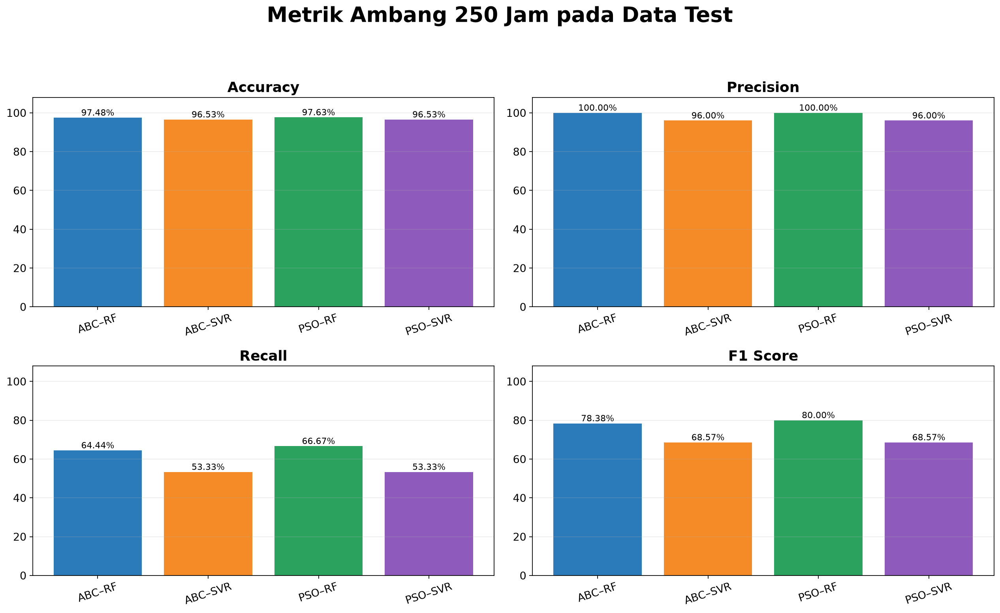

*Gambar 14. Metrik klasifikasi ambang 250 jam.*

## 9. Hyperparameter Terbaik

| Kandidat | Hyperparameter terbaik |
|---|---|
| ABC–RF | `n_estimators=256`, `max_depth=22`, `min_samples_split=3`, `min_samples_leaf=1`, `max_features=0,61818` |
| ABC–SVR | `C=1000`, `epsilon=14,12368`, `gamma=1`, RBF |
| **PSO–RF** | `n_estimators=201`, `max_depth=16`, `min_samples_split=2`, `min_samples_leaf=1`, `max_features=0,57886` |
| PSO–SVR | `C=1000`, `epsilon=14,56930`, `gamma=1`, RBF |

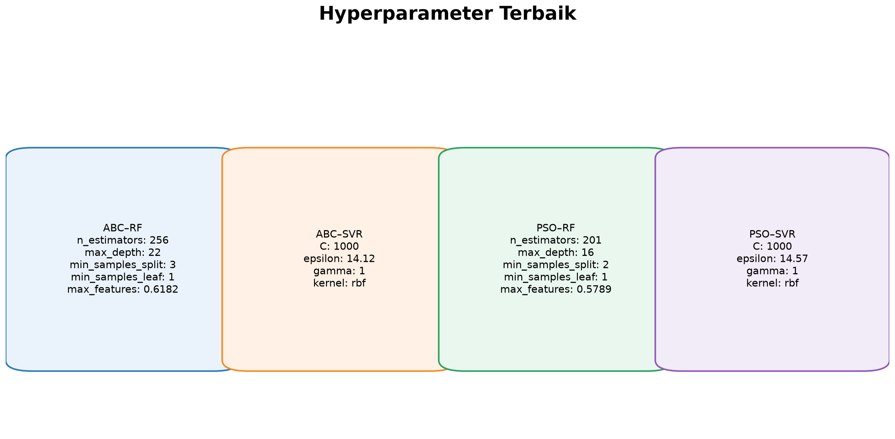

*Gambar 15. Hyperparameter terbaik tiap kandidat.*

## 10. Waktu dan Jumlah Evaluasi Optimasi

| Kandidat | Waktu | Evaluasi objektif |
|---|---:|---:|
| ABC–RF | 16,59 menit | 525 |
| ABC–SVR | 11,55 menit | 599 |
| PSO–RF | 11,88 menit | 440 |
| PSO–SVR | 18,03 menit | 549 |

Waktu pada log iterasi bersifat kumulatif. Evaluasi objektif menyatakan kandidat yang dihitung setelah cache digunakan.

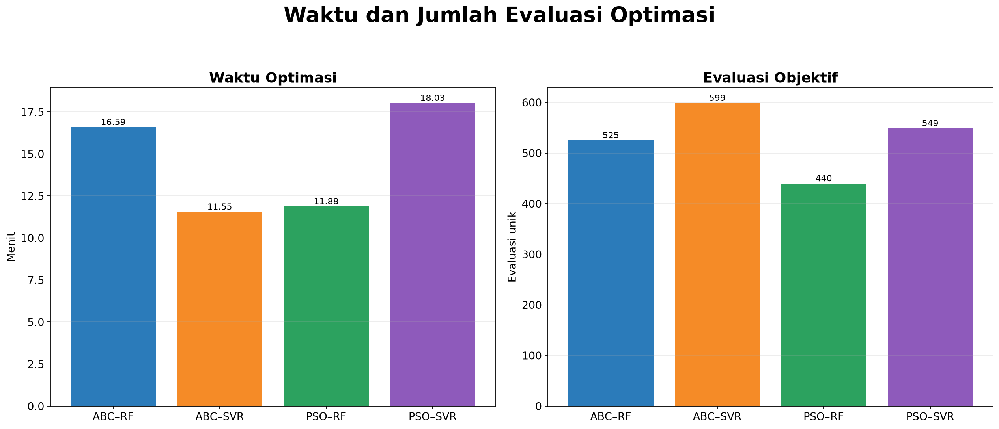

*Gambar 16. Waktu dan jumlah evaluasi optimasi.*

## 11. Build Model Final

`Build_Models.ipynb` membaca artefak, memilih CV MSE terendah, melatih ulang empat kandidat menggunakan semua data, menyimpan model, lalu menyalin PSO–RF ke `models/best_model.joblib`. Uji reload semua model berhasil.

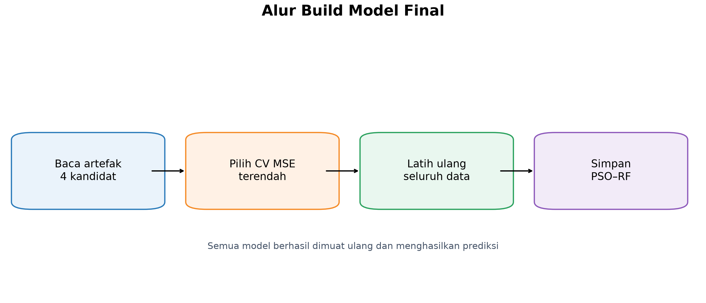

*Gambar 17. Alur build model final.*


*Gambar 18. Keluaran aktual perbandingan model setelah build.*

## 12. Analisis Hasil Target Aktual dan Pseudo-RUL

| Sumber target | Baris test | RMSE | MAE | R² |
|---|---:|---:|---:|---:|
| Aktual — PT Amanah | 507 | 133,9480 | 73,2012 | 0,96785 |
| Estimasi — 3 unit | 127 | 169,1859 | 111,8604 | 0,85813 |

Target aktual menghasilkan performa lebih baik. Metrik tiga unit lain mengukur kecocokan dengan pseudo-RUL dari model referensi, bukan dengan break nyata.

| Unit | Baris test | RMSE | R² | Target |
|---|---:|---:|---:|---|
| PT Amanah | 507 | 133,9480 | 0,96785 | Aktual |
| Unit 228 | 34 | 130,3292 | 0,91643 | Estimasi |
| Unit 230 | 40 | 188,8661 | 0,75515 | Estimasi |
| Unit 231 | 53 | 175,4186 | 0,87063 | Estimasi |

Accuracy 100% pada subset estimasi tidak bermakna sempurna: 127 baris test subset itu seluruhnya kelas negatif pada ambang 100, 250, dan 500 jam. Tidak ada sampel positif, sehingga Recall dan F1 Score bernilai nol.

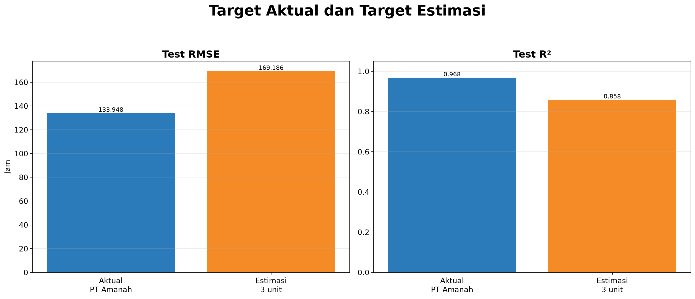

*Gambar 19. Kinerja PSO–RF pada target aktual dan pseudo-RUL.*

## 13. Keterbatasan

1. Hanya PT Amanah mempunyai break aktual.
2. Tiga unit lain memakai 600 pseudo-label.
3. Split acak mencampurkan baris unit yang sama ke train dan test.
4. Generalisasi ke unit baru belum diuji.
5. Metrik klasifikasi dapat tampak tinggi saat sampel positif sangat sedikit.

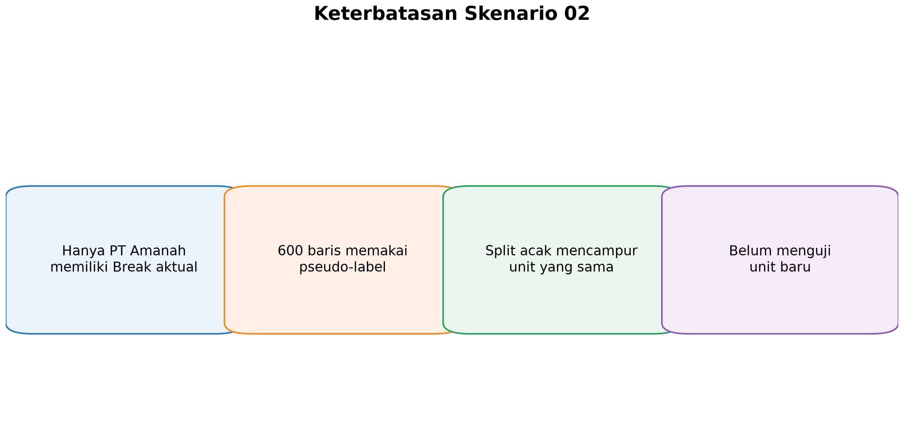

*Gambar 20. Keterbatasan utama Skenario 02.*

## 14. Rekomendasi

1. Kumpulkan waktu break aktual Unit 228, Unit 230, dan Unit 231.
2. Ulangi eksperimen tanpa pseudo-label.
3. Gunakan Group K-Fold atau leave-one-unit-out.
4. Beri perhatian lebih besar terhadap FN dalam objective atau pemilihan threshold.
5. Laporkan target aktual, target estimasi, dan per unit secara terpisah.

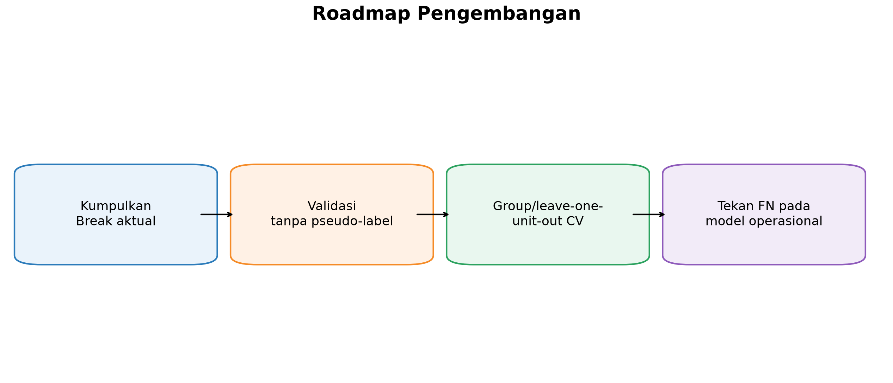

*Gambar 21. Roadmap pengembangan berikutnya.*

## 15. Kesimpulan

Skenario 02 berhasil membangun pipeline data gabungan dan memilih **PSO–Random Forest** sebagai model terbaik berdasarkan CV MSE. Test RMSE mencapai 141,71 jam dan test R² mencapai 0,96781.

Hasil PT Amanah mendukung kemampuan model terhadap target aktual. Hasil tiga unit lainnya tetap harus dibaca sebagai performa terhadap pseudo-RUL. Validasi operasional lintas-unit memerlukan break aktual dan validasi berbasis unit.

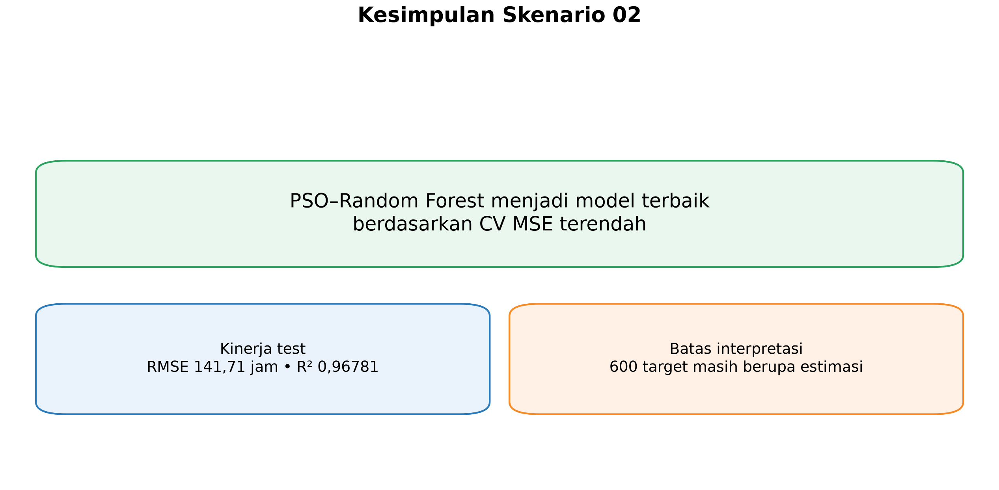

*Gambar 22. Kesimpulan performa dan batas interpretasi.*

---

### Artefak Utama

- Model final: `models/best_model.joblib`
- Ringkasan build: `models/build_summary.json`
- Perbandingan model: `models/model_comparison.csv`
- Perbandingan threshold: `models/threshold_comparison.csv`

Laporan ini disusun dari artefak hasil eksekusi aktual dan tidak mengubah isi `oldcode/`.
